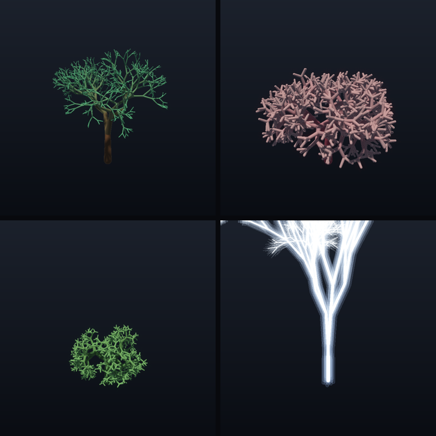

# wggrow

**D3D12 Work Graphs** で、GPU が枝を**再帰的に自己生成**して樹・珊瑚・稲妻などを育てる
プロシージャル生成デモ。生成した capsule 群の union SDF をスフィアトレースで描画する。




同じ再帰グラフのパラメータを変えるだけで、樹 / 珊瑚 / 藪 / 稲妻を出し分ける。上の動画は
根から先端へ育っていく様子（GPU の再帰展開そのもの）。

## なぜ Work Graphs か

Work Graphs は 2024 年に D3D12 に入った新しい実行モデルで、**GPU 上のシェーダが自分で次の仕事を
生成・展開**できる（ノードが子ノードを起動、再帰も可）。従来は CPU が dispatch 数を固定で決めていた。
枝分かれのように「どれだけ仕事が増えるかが実行時に決まる再帰」は、この仕組みの本領。まだ使用例が
少ない新 API に、再帰プロシージャル生成という題材を載せて、動くところまで実装した。

## 仕組み

1. **生成 (Work Graph)**: `Branch` ノードが枝 1 本を capsule バッファへ atomic append し、
   `depth>0` なら円錐状に散らした子 record を自分自身へ emit する (`NodeMaxRecursionDepth`)。
   GPU だけで再帰的に木構造が展開される。
2. **描画 (compute)**: 生成された capsule 群の union SDF をスフィアトレースし、法線・soft shadow・
   AO で陰影付け。発光プリセット（稲妻）は emissive + bloom で光らせる。
3. **成長アニメ**: 各 capsule に「生まれる深さ割合」を持たせ、成長前線を根→先端へ動かして伸ばす。

## 必要環境

- Windows 10/11、**Work Graphs Tier 1.0 対応 GPU**（RTX 30 系以降 / RDNA 系、最近のドライバ）
- Visual Studio 2022 (C++20)
- 単独 DX12 プロジェクト（レイトレ専用コア不要、Work Graphs は全部コンピュート）

## ビルド

```powershell
powershell -ExecutionPolicy Bypass -File fetch_deps.ps1   # Agility SDK + DXC を取得 (初回のみ)
```
つぎに「x64 Native Tools Command Prompt for VS 2022」で:
```
build.bat
build\wggrow.exe --preset coral --out out.png
```

## 実行

```
wggrow            # そのまま起動 → 窓が開く。全部この中で切り替える
```

引数は不要。窓の中でプリセット（Tree / Coral / Bush / Lightning）を切り替え、生成パラメータ
（分岐数・深さ・広がり・長さ比・半径比・ねじれ・色・発光）をスライダーで変更する。パラメータを
いじると Work Graph が即座に再生成する。ドラッグ = 回転、ホイール = ズーム、auto grow で成長アニメ、
Regrow で最初から。

画像・動画を書き出したいときだけフラグを使う:
```
wggrow --out x.png --preset coral            # 1 枚
wggrow --seq frames --frames 90 --preset tree # 成長アニメ連番 (frames/ に PNG)
```

## ライセンス

MIT License (`LICENSE`)。Copyright (c) 2026 mogmog-0110。

同梱の第三者コード: Dear ImGui (MIT)、stb_image_write (public domain)。
実行時 SDK (Agility SDK / DXC) は `fetch_deps.ps1` で取得（Microsoft ライセンス、非同梱）。

---

Work Graphs: D3D12 Agility SDK (Microsoft, 2024)。
